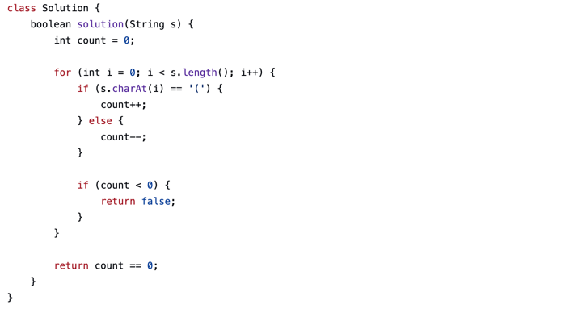

# 📘 4월 정기 모임
> KBDS 은행사업본부 CoP **알골중독**

---

# 📑 목차

## 1. 강의
> 지난 과제 중 주요 유형 / 자료구조 / 알고리즘 복습 및 보충 설명

- Stack
- Queue
- Deque

---

## 2. 모의고사
> PCCP 동일 환경으로 진행하는 실전 모의고사

### 기초 레벨 풀이

- 문제 레벨 : Lv.1 ~ Lv.2
- 문제 개수 : 2문제
- 제한 시간 : 50분
- 환경 제한
  - Web 검색 금지
  - IDE 사용 금지

---

## 3. 코드 발표

> 모의고사 풀이 코드 공유 및 접근 방법 발표

발표 내용

- 문제 접근 전략
- 풀이 과정
- 어려웠던 점
- 개선 가능한 방법
- Q&A

---

# 1️⃣ 강의

## 📌 강의 주제

### Stack & Queue & Deque

---

## ❓ Why?

### 1) 코딩테스트 핵심 자료구조

다음 개념의 이해를 위해 반드시 필요합니다:

- DFS → Stack 기반
- BFS → Queue 기반
- Sliding Window / 0-1 BFS → Deque 기반

즉,

```
DFS 이해 = Stack 이해
BFS 이해 = Queue 이해
최적화 BFS 이해 = Deque 이해
```

---

### 2) 지난주 과제 활용 미흡

지난 과제에서 기대했던 접근 방식:

- Stack 활용 풀이
- Queue 활용 풀이

대표 예시:

- [올바른 괄호 문제](https://school.programmers.co.kr/learn/courses/30/lessons/12909)

의도와 다른 풀이:


자료구조 선택이 풀이 난이도를 크게 낮출 수 있음

---

## 📚 발표자료

- [PDF 파일 열기](O(1)_Pipeline_Mastery.pdf)
- [스택 문서 보기](../../../study/data_structure/stack.md)
- [큐 문서 보기](../../../study/data_structure/queue.md)
- [덱 문서 보기](../../../study/data_structure/deque.md)

---

# 2️⃣ 모의고사

## 📌 진행 방식

> 프로그래머스 스킬체크 및 PCCP 기준 환경 설정

### 제한 시간

- 50분

### 문제 목록

- [햄버거 만들기](https://school.programmers.co.kr/learn/courses/30/lessons/133502)
- [두 큐 합 같게 만들기](https://school.programmers.co.kr/learn/courses/30/lessons/118667)

---

## 📎 참고 가능 자료

공식 문서만 참고 가능

- [Java](https://devdocs.programmers.co.kr/openjdk~11/)
- [Python](https://devdocs.programmers.co.kr/python~3.8/)
- [JavaScript](https://devdocs.programmers.co.kr/javascript/)

---

# 3️⃣ 코드 발표

## 📊 1차 모의고사 결과

- 2문제 해결
- 1문제 해결
- 0문제 해결

---

## 💻 발표 코드

### Java

```java
code1
```

---

### Python

```python
code2
```

---

### JavaScript

```javascript
code3
```