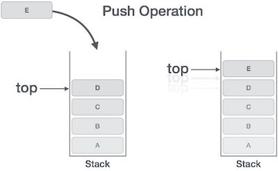
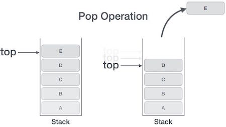
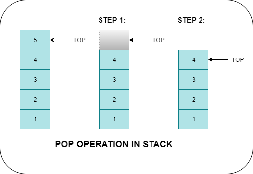

# 📘 스택 (Stack)

## ✅ 개념 설명

스택(Stack)은 **후입선출(LIFO: Last-In-First-Out)** 원칙을 따르는 선형 자료구조입니다.  
쉽게 말하면 **나중에 넣은 데이터가 먼저 나온다**는 구조입니다.

예시:

```
접시 쌓기

[ A ]
[ B ]
[ C ]  ← 가장 위(top)

꺼낼 때는 C → B → A 순서
```

즉,

```
push(A)
push(B)
push(C)
pop() → C
```

처럼 동작합니다.

---

## 🔍 스택의 핵심 구조 (Top 개념)


 |  |  |  |
 :---: | :---: | :---: |

스택에는 항상 **top** 이라는 개념이 존재합니다.

```
현재 상태

top
 ↓
[C]
[B]
[A]
```

스택에서 모든 연산은 **top 기준으로만** 발생합니다.

| 위치 | 설명 |
|------|------|
| bottom | 가장 먼저 들어온 데이터 |
| top | 가장 마지막에 들어온 데이터 |

즉,

👉 push = top 위에 추가  
👉 pop = top 제거

---

## 🧮 주요 연산 (동작 과정 포함)

| 연산 이름  | 설명                         |
|------------|------------------------------|
| push       | 데이터를 스택의 top에 삽입    |
| pop        | 스택의 top에서 제거           |
| peek/top   | 맨 위(top)의 데이터 확인      |
| isEmpty    | 스택이 비어 있는지 확인       |

---

## 1️⃣ push 동작 과정

예:

```
초기 상태

top
 ↓
[B]
[A]
```

push(C)

```
top
 ↓
[C]
[B]
[A]
```

즉,

```
top = top + 1
데이터 삽입
```

---

## 2️⃣ pop 동작 과정

현재 상태:

```
top
 ↓
[C]
[B]
[A]
```

pop()

```
반환값 = C
```

이후 상태:

```
top
 ↓
[B]
[A]
```

즉,

```
데이터 반환
top = top - 1
```

---

## 3️⃣ peek / top

제거하지 않고 확인만 합니다.

```
peek() → C
```

스택 상태 변화 없음

---

## 4️⃣ isEmpty

```
top == -1
```

이면 비어있음

---

## ⚙️ 시간 복잡도

스택은 매우 빠른 자료구조입니다.

| 연산 | 시간 복잡도 |
|------|--------------|
| push | O(1) |
| pop | O(1) |
| peek | O(1) |
| 탐색 | O(n) |

👉 이유: 항상 **top 위치만 접근하기 때문**

---

## 🧠 직관적인 실제 사용 예시

스택은 현실에서도 많이 등장합니다.

### 1️⃣ 웹 브라우저 뒤로가기

```
naver.com 방문
google.com 방문
youtube.com 방문
```

뒤로가기:

```
pop → youtube 제거
pop → google 제거
```

---

### 2️⃣ 실행 취소 (Undo)

```
입력 A
입력 B
입력 C
```

Undo:

```
pop → C 제거
pop → B 제거
```

---

### 3️⃣ 괄호 검사 문제 (코딩테스트 단골)

예:

```
( ( ) )
```

동작 과정:

```
( → push
( → push
) → pop
) → pop
```

마지막에 stack 비어있으면 성공

---

## 🚀 DFS와 스택의 관계 (매우 중요 ⭐)

코딩테스트에서 스택이 중요한 이유는 바로 **DFS의 핵심 자료구조이기 때문**입니다.

DFS는 이렇게 동작합니다:

```
가능한 한 깊이 내려간다
막히면 되돌아온다
다른 경로 탐색한다
```

이 구조 자체가 스택과 동일합니다.

예:

```
A
├── B
│   ├── D
│   └── E
└── C
```

DFS 진행 과정:

```
push(A)
push(B)
push(D)
pop()
push(E)
pop()
pop()
push(C)
```

즉,

👉 들어갈 때 push  
👉 되돌아갈 때 pop

입니다.

---

## 💡 DFS = 재귀 = 스택

재귀 함수는 내부적으로 **스택 구조(call stack)** 를 사용합니다.

예:

```
dfs(A)
  dfs(B)
    dfs(D)
```

실제 메모리 구조:

```
dfs(D)
dfs(B)
dfs(A)
```

이게 바로 스택입니다.

그래서

```
재귀 DFS == 스택 DFS
```

라고 생각해도 됩니다.

---

## 🧪 예제 코드 (Python)

```python
stack = []

# push
stack.append("A")
stack.append("B")
stack.append("C")

print(stack)
# ['A', 'B', 'C']

# pop
print(stack.pop())
# C

# peek
print(stack[-1])
# B

# isEmpty
print(len(stack) == 0)
# False
```

---

## 🧪 DFS를 스택으로 구현하기

재귀 없이 직접 구현하면 이렇게 됩니다.

```python
graph = {
    'A': ['B', 'C'],
    'B': ['D', 'E'],
    'C': [],
    'D': [],
    'E': []
}

stack = ['A']
visited = []

while stack:
    node = stack.pop()

    if node not in visited:
        visited.append(node)
        stack.extend(reversed(graph[node]))

print(visited)
```

출력:

```
A B D E C
```

---

## 🎯 코딩테스트에서 스택이 등장하는 대표 패턴

다음 유형 나오면 **스택 먼저 의심하세요**

| 유형 | 예시 |
|------|------|
| 괄호 검사 | 올바른 괄호 |
| DFS | 그래프 탐색 |
| 이전 상태 추적 | 뒤로가기 |
| 단조 스택 | 탑 문제 |
| 문자열 제거 | 폭발 문자열 |
| 히스토그램 | largest rectangle |

특히

```
탑
주식가격
히스토그램
괄호 문제
```

는 전부 스택 대표 문제입니다.

---

## 🧩 샘플 문제 (프로그래머스)

| 문제 이름 | 링크 |
|-----------|------|
| 올바른 괄호 | https://school.programmers.co.kr/learn/courses/30/lessons/12909 |
| 기능개발 | https://school.programmers.co.kr/learn/courses/30/lessons/42586 |
| 탑 | https://school.programmers.co.kr/learn/courses/30/lessons/42588 |

---

## 📌 정리 (코딩테스트 관점 핵심 포인트)

스택은 다음 상황에서 거의 반드시 등장합니다:

```
1️⃣ 괄호 문제
2️⃣ DFS 탐색
3️⃣ 이전 상태 추적 문제
4️⃣ 단조 감소/증가 구조 문제
5️⃣ 문자열 제거 문제
```

특히

```
DFS 이해 = 스택 이해
재귀 이해 = 스택 이해
```

라고 생각해도 될 정도로 매우 중요한 자료구조입니다.